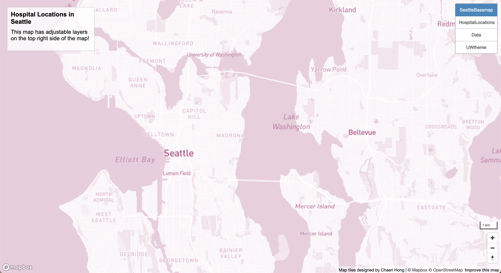
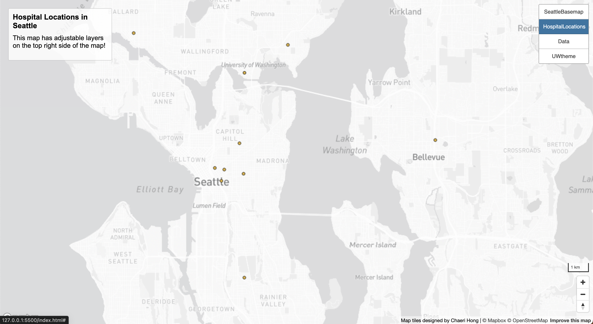
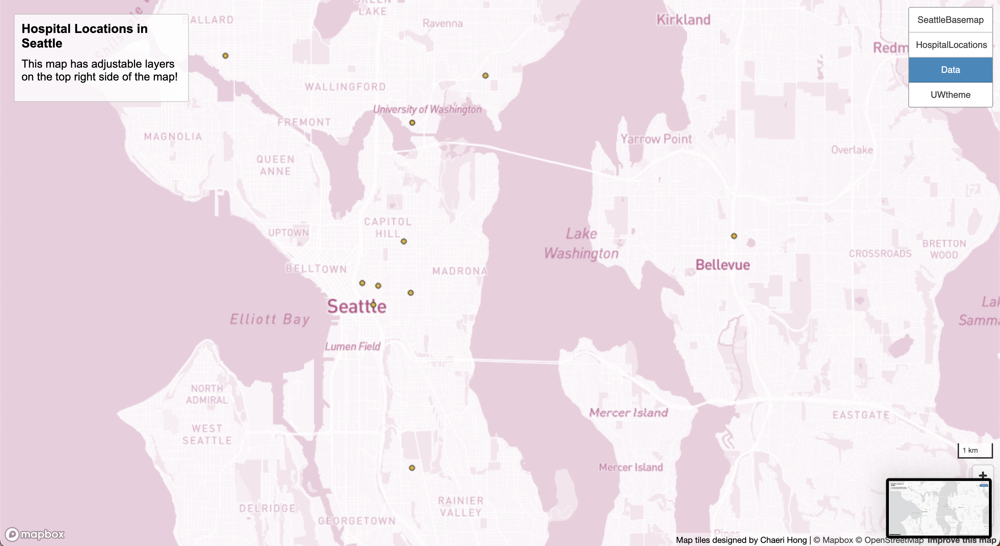

# mapDesign_tileGeneration

https://api.mapbox.com/styles/v1/chaerihong/clsj2vujh03mn01pb5xxcdyka/wmts?access_token=pk.eyJ1IjoiY2hhZXJpaG9uZyIsImEiOiJjbHM3aXpqNnUxdGZ4MmtsOGFseXdseDFrIn0.QgJzmwRnSVw86RGevik91w

file:///Users/vocensii/Desktop/geog458/mapDesign_tileGeneration/index.html

This project presents a series of interactive maps designed to showcase various geographic phenomena. Each map is themed differently, representing data ranging from base geographical features to specific thematic layers such as hospital locations, environmental data, and more.

# Geog458 MapDesign TileGeneration

## Overview

This project presents a series of interactive maps designed to showcase various geographic phenomena. Each map is themed differently, representing data ranging from base geographical features to specific thematic layers such as hospital locations, environmental data, and more.

### Maps Included

1. **Base Map**: A foundational map highlighting geographical features with a monochrome color scheme for clarity and contrast against thematic layers.
2. **Hospital Locations**: This map layer displays the locations of hospitals in Seattle, providing essential information on healthcare facilities.
3. **Data**: The basemap plus the theme layer from the preceding two tiles make up the layer group that this tile represents. For this tile, zoom layers 3 through 14 are accessible.
4. **UW-theme**: This tile is a map layer I designed on MapBox. Furthermore, this tile shows the UW theme with a variety of different colors which represent UW like purple. The available zoom layers for this tile would be from 3-14.

## Accessing the Web Map

The interactive web map can be accessed at the following URL: [https://chaerihong.github.io/mapDesign_tileGenerationPublic/](https://chaerihong.github.io/mapDesign_tileGenerationPublic/)

## Screenshots

Below are screenshots of the four layers included in the map:

- **Base Map**: 
- **Hospital Locations**: 
- **Data**: 
- **UW theme**: 

## Geographic Area Covered

The maps cover the area of Seattle.

## Zoom Levels

The tilesets for each map are available at the following zoom levels:
- Base Map: Zoom levels 3 to 14
- Hospital Locations: Zoom levels 3 to 14
- [Third Thematic Layer Name]: Zoom levels 3 to 14
- [Fourth Thematic Layer Name]: Zoom levels 3 to 14

